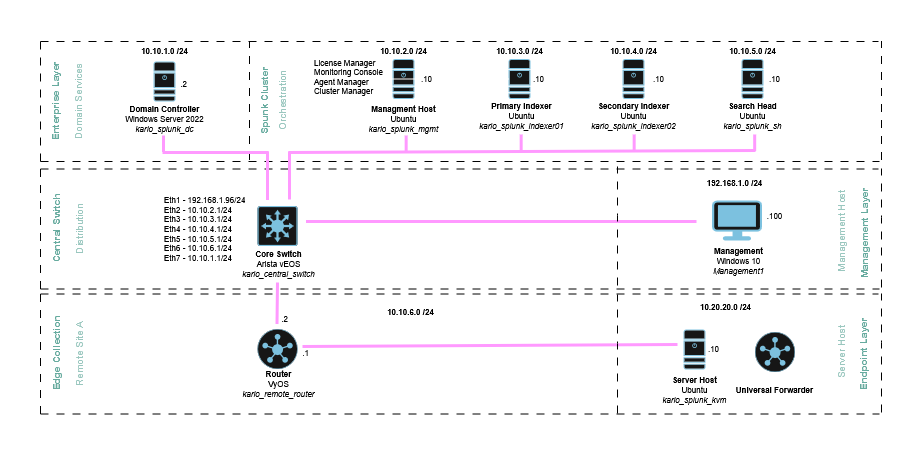
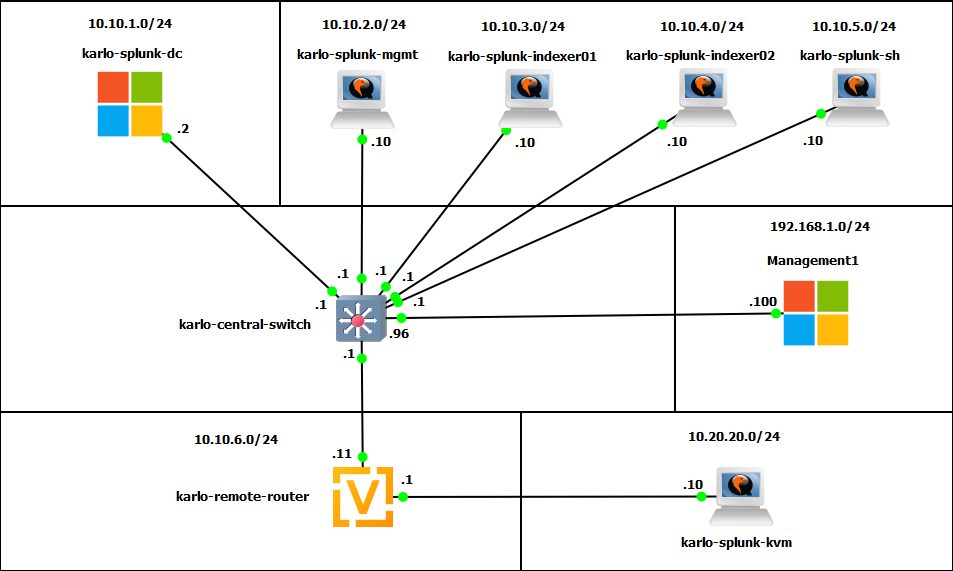
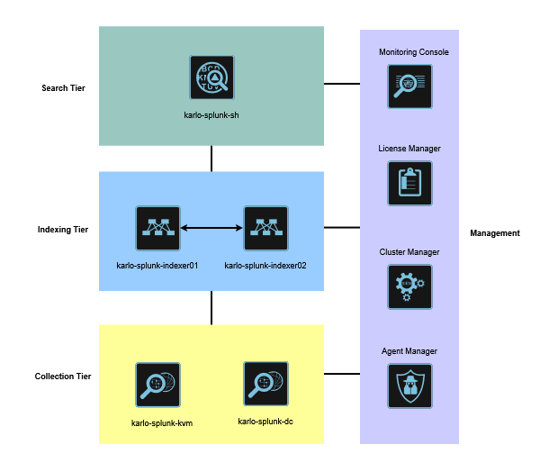
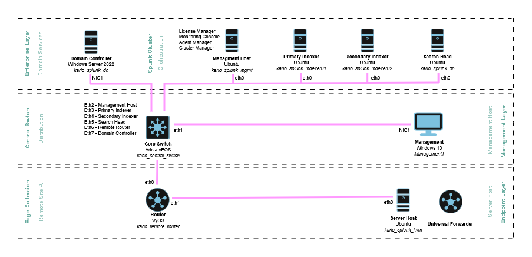
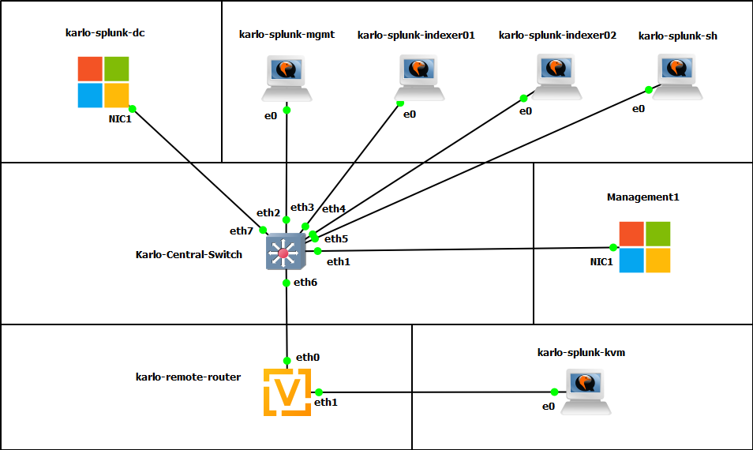
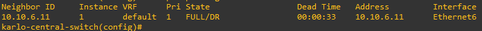
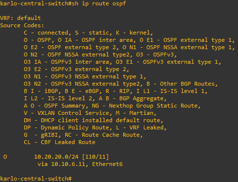
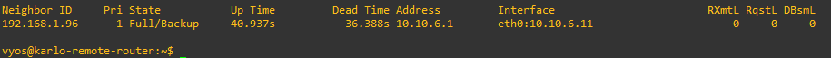
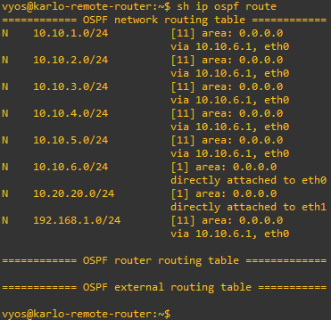
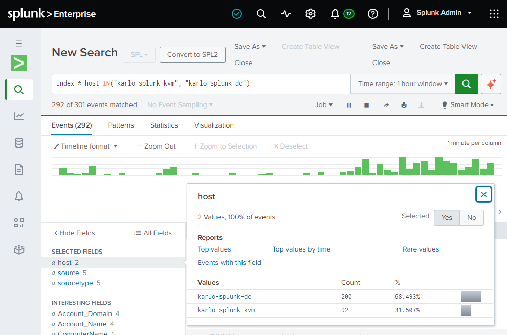

# Splunk Labs

## Table of Contents

1.0 [Summary](#10-summary)  

- 1.1 Purpose  
- 1.2 Scope  
- 1.3 References  

2.0 [Inventory](#20-inventory)  

- 2.1 Network and Server Node Specifications
- 2.2 GNS3 Resource Allocations

3.0 [Logical Topologies](#30-logical-topologies)

- 3.1 Logical Topology
- 3.2 GNS3 Logical Topology
- 3.3 Splunk Distributed Logical Topology

4.0 [Physical_Topologies](#40-physical-topologies)

- 4.1 Physical Topology
- 4.2 GNS3 Physical Topology

5.0 [Security and Hardening](#50-security-and-hardening)

- 5.1 Integrity Verification
- 5.2 Remote Access and Authentication
- 5.3 Security Controls

6.0 [Services](#60-services)

- 6.1 NTP
- 6.2 DHCP
- 6.3 DNS
- 6.4 OSPF

7.0 [Splunk Components](#70-splunk-components)

- Agent Manager
- Cluster Manager
- License Manager
- Monitoring Console
- Search Head
- Indexers

## 1.0 Summary

### 1.1 Purpose

This document outlines the design decisions made for deploying a working Splunk proof-of-concept within GNS3.  

The key objective of this document is to capture the design decisions for deploying a simulated enterprise Splunk platform that successfully receives logs and telemetry from remote servers and displays it in central dashboards utilizing a distributed indexing cluster.

### 1.2 Scope

The following are in-scope:

- Deployment of a Splunk cluster that includes a management node, two indexers, a search head, and universal forwarders on Windows and Linux servers. The management node includes the cluster manager, agent manager, license manager, and monitoring console roles.

- Deployment of Windows Server 2022 and configuration of Active Directory, NTP, DNS, and Certificate services.

- Simulation of a remote area and the collection of data that is sent to the main splunk cluster via a router.

- OSPF will be the dynamic routing protocol used to advertise all networks across the lab.

- Installation of Universal Forwarders on a Linux and Windows server.

- Security hardening considerations have been implemented based on Splunk documentation.

The following are out-of-scope for simplicity:

- Scaling performance and sizing of a Splunk deployment is excluded. The intent was to deploy as many components as possible for creating a proof-of-concept. Resources such as the Splunk Deployment Capacity manual would be referenced to optimize and scale Splunk based on user count, search count, and other performance metrics.

- Dual Domain Controllers are out of scope due to the limitations of memory and CPU to accommodate all Splunk components. Splunk Labs will only run with one.

- Switch redundancy considerations, network optimization, advanced network segmentation (subnet efficiencies) are excluded from the design to focus solely on the deployment and configuration of Splunk as opposed to simulating a complex and modern enterprise network topology. This includes firewall deployment and configuration.

- Deployment and configuration of SANs and other storage devices are excluded. This includes backup and replication considerations due to time and resource constraints.

- Extensive security hardening and auditing as per recommendations from the New Zealand Information Security Manual (NZISM) has been excluded for this lab design. However, Splunk recommendations have been applied where possible.

- A heavy forwarder has not been implemented. It was decided that the small amount of logs likely to be received from the single Linux server, didn't justify deploying a heavy forwarder. The universal forwarder was decided as sufficient to simulate logs being ingested from a separate network back into the cluster.

- TLS and certificate authentication between splunk nodes are excluded.

### 1.3 References

The following are some of the resources used to deploy and design Splunk Labs:

| Resource | URI |
| ------------ | ------- |
| Splunk Enterprise Administration Manual | <https://help.splunk.com/en/splunk-enterprise/administer/admin-manual/10.4/welcome-to-splunk-enterprise-administration/how-to-use-this-manual> |
| Implement a Distributed deployment | <https://help.splunk.com/en/splunk-enterprise/administer/distributed-deployment-manual/10.4/implement-a-distributed-deployment/start-implementing-your-distributed-deployment> |
| Plan your Splunk Enterprise Installation | <https://help.splunk.com/en/splunk-enterprise/get-started/install-and-upgrade/10.4/plan-your-splunk-enterprise-installation/installation-overview> |
| Typical Deployment Scenarios, with Implementation Frameworks | <https://help.splunk.com/en/splunk-enterprise/administer/distributed-deployment-manual/10.4/typical-deployment-scenarios-with-implementation-frameworks/departmental-deployment-single-indexer> |
| Overview of Splunk Enterprise Distributed Deployments | <https://help.splunk.com/en/splunk-enterprise/administer/distributed-deployment-manual/10.4/overview-of-splunk-enterprise-distributed-deployments/scale-your-deployment-with-splunk-enterprise-components> |
| Configure the Monitoring Console | <https://help.splunk.com/en/splunk-enterprise/administer/monitor/10.4/configure-the-monitoring-console/monitoring-console-setup-prerequisites> |
| Secure your Splunk Enterprise Installation | <https://help.splunk.com/en/splunk-enterprise/get-started/install-and-upgrade/10.4/secure-your-splunk-enterprise-installation/install-splunk-enterprise-securely> |
| Components and their Relationship with the Network | <https://help.splunk.com/en/splunk-enterprise/administer/inherit-a-splunk-deployment/10.4/inherited-deployment-tasks/components-and-their-relationship-with-the-network> |

## 2.0 Inventory

### 2.1 Network and Server Node Specifications

The following are the virtual machines or virtual network devices deployed in GNS3 for Splunk labs

| Device Name | Operating System | Role |
| ----------- | ---------------- | ---- |
| karlo-splunk-dc | Windows Server 2022 | Enterprise Services (AD, NTP, DNS, DHCP, CA) |
| karlo-splunk-mgmt | Ubuntu 24.04 LTS | Management Node (License Manager, Agent Management, Monitoring Console, Cluster Manager) |
| karlo-splunk-indexer01 | Ubuntu 24.04 LTS | Primary Indexer |
| karlo-splunk-indexer02 | Ubuntu 24.04 LTS | Secondary Indexer |
| karlo-splunk-sh | Ubuntu 24.04 LTS | Search Head node |
| karlo-central-switch | Arista vEOS Switch | Core Layer 3 Switch |
| karlo-remote-router | VyOS Router | Router |
| karlo-splunk-kvm | Ubuntu 24.04 LTS | Linux Server Host |
| Management1 | Windows 10 | Management Jump Box |

>[!NOTE]  
> The domain name for the Windows environment is splunk.labs.

### 2.2 GNS3 Resource Allocations

The physical hardware limitation of my PC acting as a hypervisor heavily determined the number of VMs I could create to simulate a sufficiently complex enterprise Splunk environment. Consideration was given to the roles that each component plays and whether or not concessions could be made in order to successfully deliver a working proof-of-concept, fully aware that it does not meet Splunk recommended resources that would be required in a true production environment.

Some considerations and concessions were:

- Both Indexers were dropped to 3GB since there are only two servers forwarding logs within the lab.

- The Management Node and Search Head were set at 5GB.

- Endpoint servers and workstations were set at their minimums. 

>[!NOTE]  
> I needed to free up memory and decided to combine the Cluster Manager node as the 4th role within the Management Host. This made sense since the Monitoring Console, Agent Manager, and License Manager were all management functions. This allowed the search head to be on its own dedicated 5GB VM due to the resource hungry nature of this role.

The total memory resource allocations (which was the limiting factor) were as follows:

The Splunk Control & Presentation Plane (10 GB)

- Management Host (5 GB)
- Search Head (5 GB)

The Splunk Data & Routing Plane (6 GB)

- Indexer 01 (3 GB)
- Indexer 02 (3 GB)

The Core Infrastructure (12 GB)

- Windows Server 2022 DC (4 GB)
- Ubuntu Server Host (2 GB)
- Arista vEOS Core Switch (2 GB)
- VyOS Router (2GB)
- Windows 10 Management PC (2 GB)

>[!NOTE]  
> A Universal Forwarder is installed on the Domain Controller and the Linux Server at the edge collection layer. Also, vCPU is allocated as 2 across all devices except the Linux Host server and the Arista switch.

## 3.0 Logical Topologies

### 3.1 Logical Topology



### 3.2 GN3 Logical Topology



### 3.3 Splunk Distributed Cluster Topology  

  

Reference: <https://help.splunk.com/en/splunk-cloud-platform/forward-and-process-data/universal-forwarder-manual/10.4/working-with-the-universal-forwarder/advanced-configurations-for-the-universal-forwarder>  

## 4.0 Physical Topologies  

### 4.1 Physical Topology  

  

### 4.2 GNS3 Physical Topology  

  

## 5.0 Security and Hardening

There are security measures configured within Splunk Labs, but it is an exhaustive list and has been chosen for its ability to be implemented to meet the lab deadline. The intent is to demonstrate adherence to the principle of least privilege and the other considerations that would be applied to a production instance of Splunk.

### 5.1 Integrity Verification

Reference: <https://help.splunk.com/en/splunk-enterprise/get-started/install-and-upgrade/10.4/secure-your-splunk-enterprise-installation/install-splunk-enterprise-securely>

As per Splunk recommendations, the SHA512 hash value provided for the Splunk Linux Enterprise 10.4.0 was compared with a local check of the hash value using PowerShell on my management PC.

The hash value and .deb file can be found on the Splunk website when downloading the application. A copy of the [SHA512](../../03_assets/3_1_images/SHA_integrity/splunk-10.4.0-f798d4d49089-linux-amd64.deb.sha512) hash file from Splunk is provided in the assets directory.

Comparison Check:  


### 5.2 Remote Access and Authentication

References:  

1. <https://help.splunk.com/en/splunk-enterprise/get-started/install-and-upgrade/10.4/install-splunk-enterprise-on-windows/choose-the-windows-user-splunk-enterprise-should-run-as>  
2. <https://help.splunk.com/en/splunk-enterprise/administer/manage-users-and-security/10.4/install-splunk-enterprise-securely/use-network-access-control-lists-to-protect-your-splunk-enterprise-deployment>

The following distinct credentials have been created:

1. Local OS Admin Account for OS patching, modifying network configurations and UFW rules. as well as restarting the host.

   `Account: Splunkserver`

2. Splunk service account as the unprivileged local service account.

   `Account: Admin`

3. Web GUI access accounts are separated with separate admin and user accounts, authenticated via LDAP. However, the Splunk GUI for Users and Roles failed to load in my instance of Splunk Enterprise so i wasn't able to drill down into the various settings that could applied to roles and users.

The LDAP GUI configuration page also failed to load, so I needed to manually configure the Splunk server as per the reference guide to configure LDAP authentication. <https://help.splunk.com/en/splunk-enterprise/administer/manage-users-and-security/9.4/perform-advanced-configuration-of-ldap-authentication-in-splunk-enterprise/configure-ldap-using-configuration-files#def6f0f8_5226_4ab5_858a_a818e649289a--en__Configure_LDAP_using_configuration_files>

   `Accounts: Splunk Admin & Splunk User`

### 5.3 Security Controls

References:  

1. <https://help.splunk.com/en/splunk-enterprise/administer/manage-users-and-security/10.4/secure-splunk-platform-communications-with-transport-layer-security-certificates/configure-tls-certificate-host-name-validation-for-secured-connections-between-splunk-software-components>  
2. <https://help.splunk.com/en/splunk-enterprise/administer/manage-users-and-security/10.4/install-splunk-enterprise-securely/disable-unnecessary-splunk-enterprise-components>
3. <https://help.splunk.com/en/splunk-enterprise/administer/manage-users-and-security/10.4/install-splunk-enterprise-securely/secure-splunk-enterprise-service-accounts>

Network and application vulnerabilities are mitigated through server-based firewalls and Splunk configurations.

Management Plane Isolation: The Uncomplicated Firewall on Ubuntu is used to configure a simple security settings to act as the gatekeeper in lieu of network level security that would have been provided by dedicated firewalls. For instance, all inbound traffic is dropped by default and SSH access is whitelisted to a dedicated physical Management PC. Refer to the [uncomplicated firewall rules](../../02_configurations/2_2_ubuntu_server/ufw_rules.md) page for details on the configuration settings used.

Ubuntu servers are restricted to use only the Domain Controller for NTP by amending the `timesyncd.conf` file to minimize the risk of spoofing.

## 6.0 Services

### 6.1 NTP

The Domain Controller will be used as the central stratum 1 time source for Splunk Labs and will be configured to be an NTP server and provide a time source of all devices.

Verification of initial configuration of the DC as an NTP stratum 1 source can be found in the [appendix_d_ntp](../1_2_verification_and_testing/appendix_d_ntp.md) section. This page also includes verification of NTP settings for the following devices:

:white_check_mark: karlo-splunk-mgmt
:white_check_mark: karlo-splunk-indexer01
:white_check_mark: karlo-splunk-indexer02
:white_check_mark: karlo-splunk-sh
:white_check_mark: karlo-splunk-kvm
:white_check_mark: karlo-central-switch
:white_check_mark: karlo-remote-router

### 6.2 DHCP

DHCP scopes have been configured for the following networks:

```text
10.10.2.0/24 
   Start IP Address: 10.10.2.10
   End IP Address: 10.10.2.254
   Lease Duration: 21 Days

10.10.3.0/24
   Start IP Address: 10.10.3.10
   End IP Address: 10.10.3.254
   Lease Duration: 21 Days

10.10.4.0/24
   Start IP Address: 10.10.4.10
   End IP Address: 10.10.4.254
   Lease Duration: 21 Days

10.10.5.0/24
   Start IP Address: 10.10.5.10
   End IP Address: 10.10.5.254
   Lease Duration: 21 Days

10.10.6.0/24
   Start IP Address: 10.10.6.10
   End IP Address: 10.10.6.254
   Lease Duration: 21 Days

192.168.1.0/24
   Start IP Address: 192.168.1.100
   End IP Address: 192.168.1.150
   Lease Duration: 21 Days
```

>[!NOTE]  
> The first 10 IP addresses for each DHCP scope are reserved.  

Verification of initial DHCP settings can be found in [appendix_c_dhcp](../1_2_verification_and_testing/appendix_c_dhcp.md).

### 6.3 DNS

All devices will use the Domain Controller as the primary DNS source.

Reverse lookup zones will be created for:

```text
1.168.192.in-addr.arpa
2.10.10.in-addr.arpa
3.10.10.in-addr.arpa
4.10.10.in-addr.arpa
5.10.10.in-addr.arpa
6.10.10.in-addr.arpa
```

Verification of initial DNS settings can be found in [appendix_b_dns](../1_2_verification_and_testing/appendix_b_dns.md).

### 6.4 OSPF  

For simplicity, Splunk Labs only deploys an Arista layer 3 switch and a VyOS router. Despite the simplicity of the lab, a mix of static and dynamic routing has been configured to advertise the routes between the main cluster and the remote network.

Arista Switch OSPF Verification

  

  

VyOS Router OSPF Verification

  

  

## 7.0 Splunk Components

### Agent Manager

  

### Cluster Manager

  

  

### License Manager

  

>[!NOTE]  
> All Splunk servers remain configured as standalone due to the use of a trial license.  

### Monitoring Console

  

  

### Search Head

  

  

### Indexers

  
