# Splunk Labs DHCP Configuration

## Domain Controller Configuration
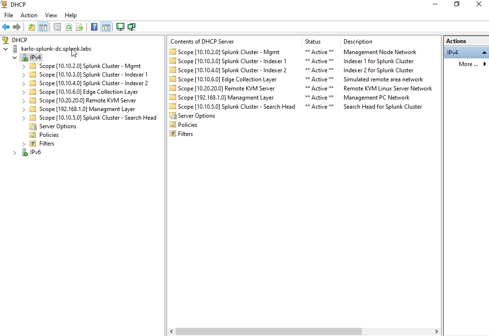

## Ubuntu Server Verification

### Karlo-splunk-mgmt

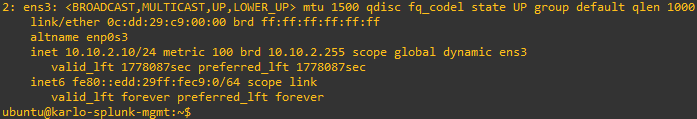  

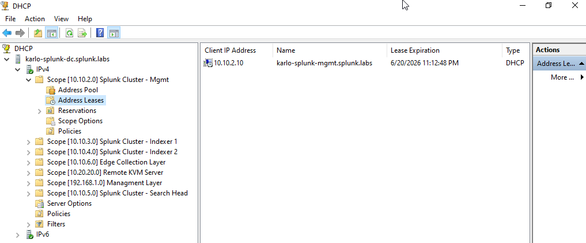  

### Karlo-splunk-indexer01

  

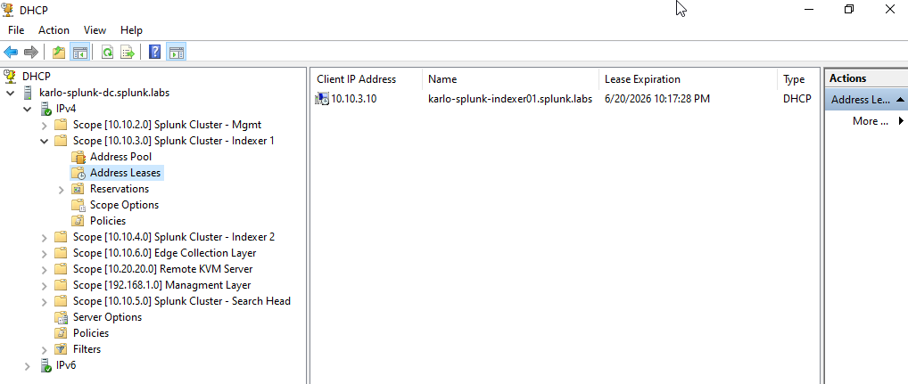  

### Karlo-splunk-indexer02

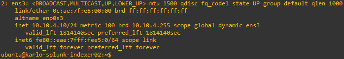  

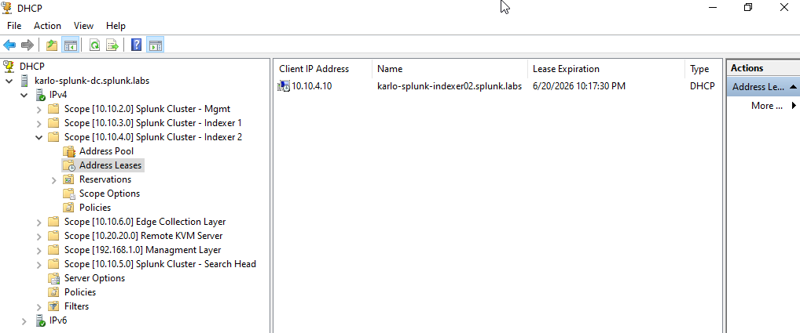  

### Karlo-splunk-sh

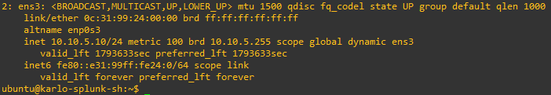  

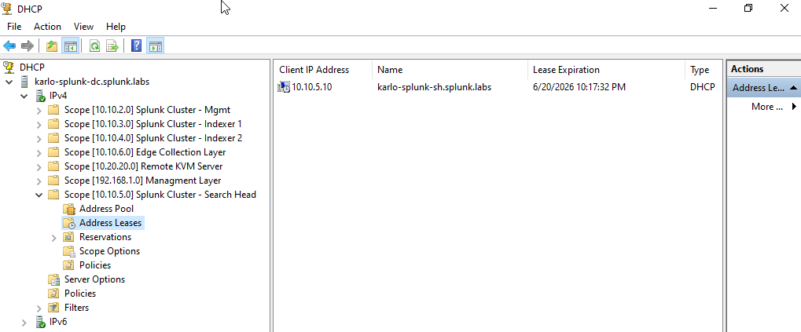  

### Karlo-splunk-kvm  

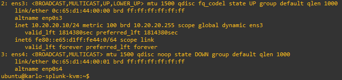  

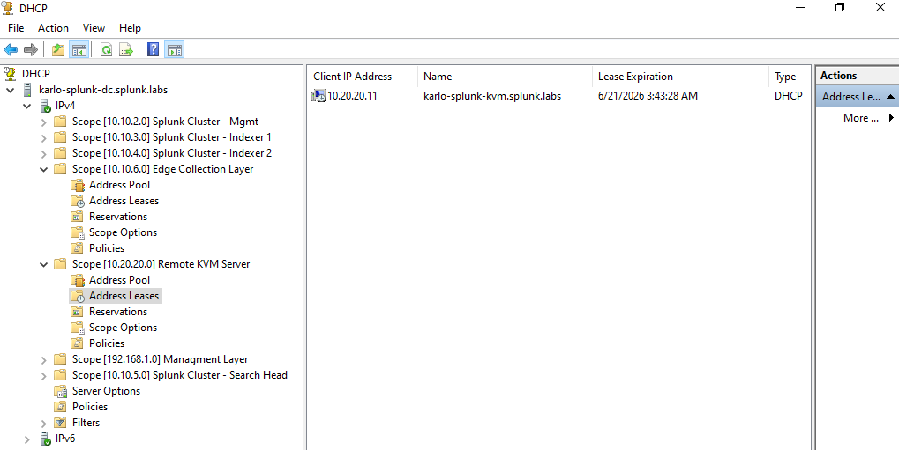  

### Karlo-remote-router

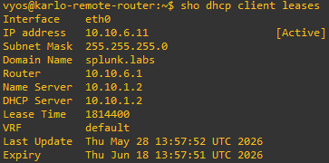  

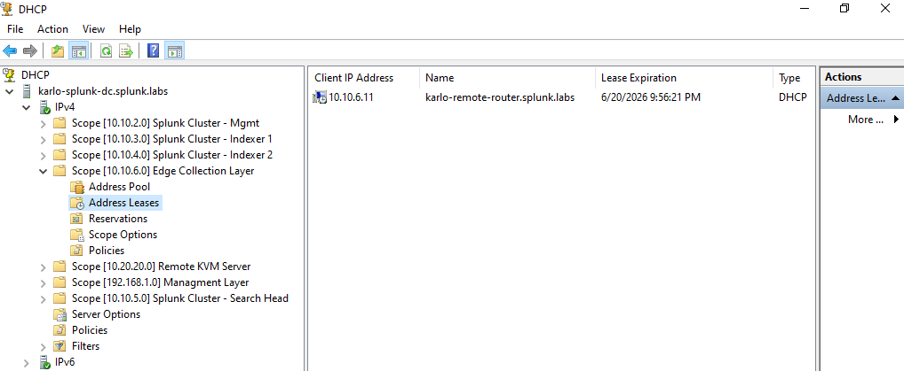  

### Management-pc

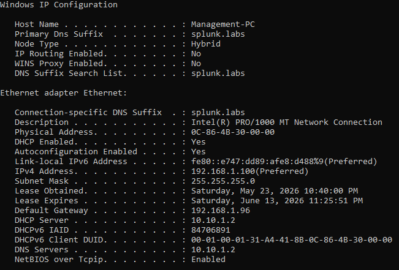  

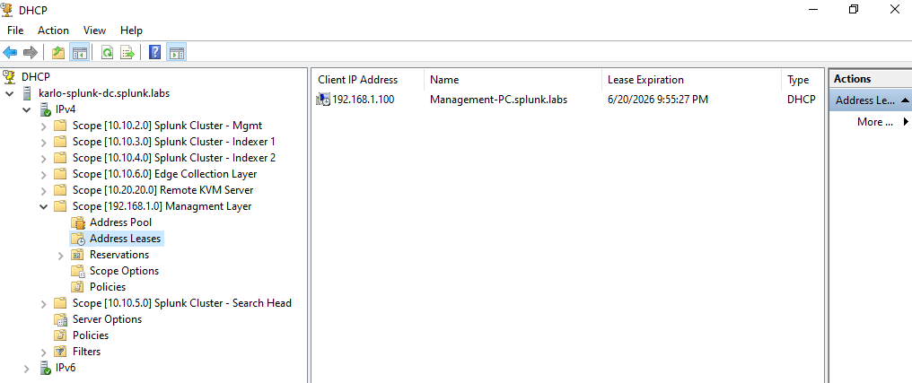  
