# Splunk Labs NTP server Confirmation  

## Domain Controller Settings

## Ubuntu Server Verification

Commands

Configuration File - `sudo nano /etc/systemd/timesyncd.conf`  
Restart Time Engine - `sudo systemctl restart systemd-timesyncd`  
Verify NTP Source - `systemctl status systemd-timesyncd`  
Check Time Status - `timedatectl status`  

## karlo-splunk-mgmt  

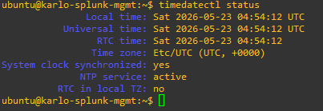

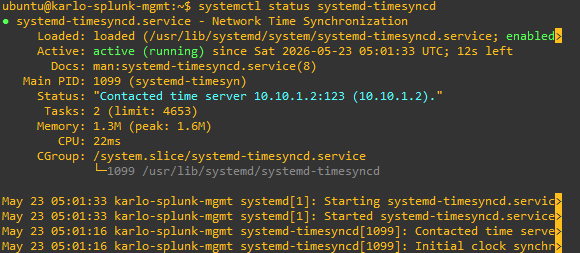

## karlo-splunk-kvm  

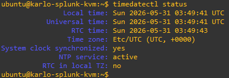  

  

## karlo-splunk-indexer01

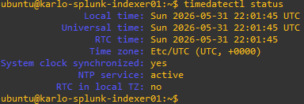  

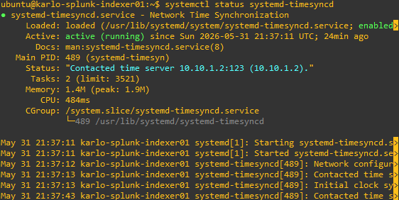  

## karlo-splunk-indexer02

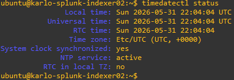  

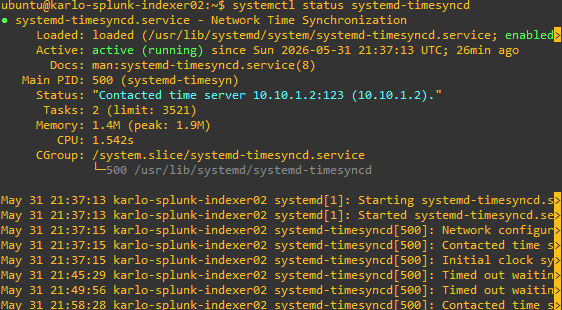  

## karlo-splunk-sh

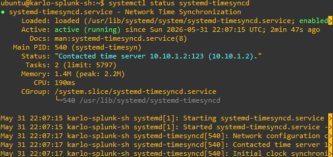  

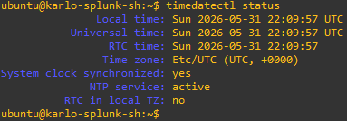  

## karlo-remote-router

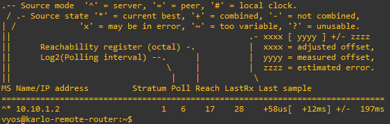  

## karlo-central-switch

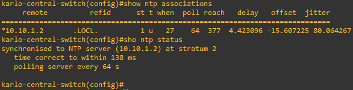  
