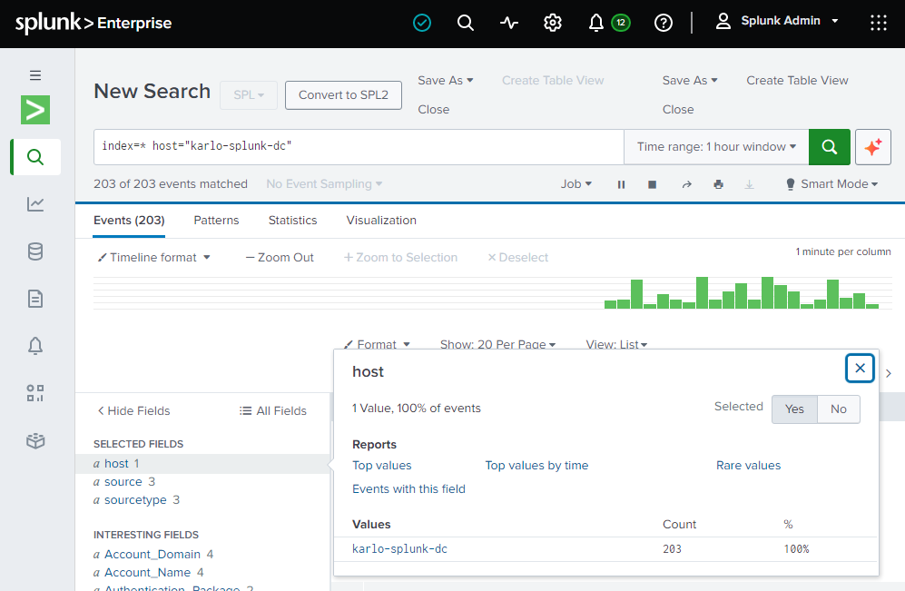
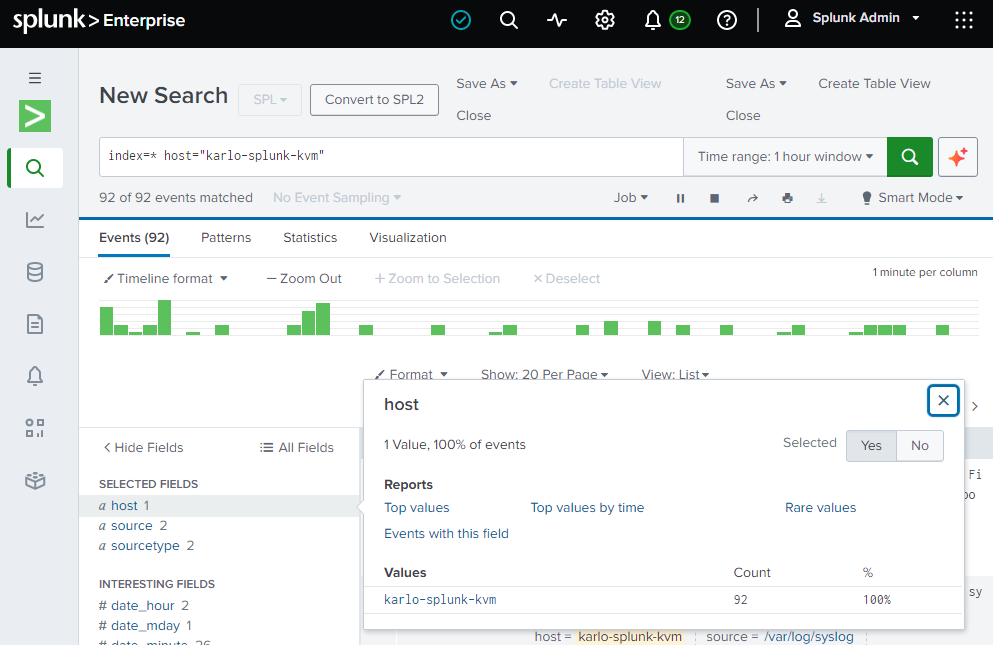

# Project Splunk Labs | Proof of Concept Development Sandbox

This is an active repository that contains a proof-of-concept deploying a distributed Splunk model using a small enterprise, single search head with multiple headers, architecture.

## Overview

Splunk Labs was designed to record the outcome of deploying a simple distributed Splunk architecture using minimal and lightweight resources in order to simulate and configure as many components as possible within the confines of my PC's resources.

The repository has been created to simulate the level of details and documentation that I would typically implement for deploying infrastructure. The document is intended to simulate real document for a production environment but is a work-in-progress due to the limited scope of the project's goals, which focusses on the Splunk application as opposed to equally simulating a complex enterprise environment.  

Limitations of virtualizing a lab within GNS3 should be kept in mind as well as the condensed timeline given to the project.  

Key objectives:

:white_check_mark: Demonstrate design and documentation skills  
:white_check_mark: Deploy Splunk 10.4 and associated infrastructure and servers to achieve a working proof-of-concept model.  
:white_check_mark: Provide evidence that a Linux and Windows server can both forward logs using a distributed Splunk Cluster.  

## Lab Devices & Applications

Network

| Network Device | Purpose |
| ------------ | ------- |
| Arista vEOS Core Layer 3 Switch | Single switch to physically connect all devices together and route between networks |
| VyOS Router | Edge router to simulate ingesting logs from a separate network area such as a separate room or isolated area |

| Server Nodes | Purpose |
| ------------ | ------- |
| Windows 2022 server | Hosts all enterprise VMs needed to deploy Splunk |
| Ubuntu 24.04 LTS server | Splunk instances for the various roles |

| Client Nodes | Purpose |
| ------------ | ------- |
| Windows 11 client | Management PC for accessing dashboards through a web GUI. This is my physical PC. |

Applications and Virtual Machines

| Application and Virtual Machines | Component | Purpose |
| ----------- | --------- | ------- |
| Splunk | License Manager | Tracks daily ingestion limits and licensing |
| | Agent Management | Pushes configs to Forwarders |
| | Monitoring Console | Audits Cluster Health |
| | Cluster Manager | Governs the Indexer Cluster |
| | Indexer | Provides data processing and storage for local and remote data |
| | Search Head | Distributes searches to Indexers and displays results from remote search peers |
| | Forwarders | Universal used to forward data to remote Indexers |
| Windows Server 2022 | Active Directory | Account management and role-based access control |
| | NTP | Central time keeping to ensure all events correlate across all devices within the lab |
| | DNS | Resolve IP address to names |
| | DHCP | Assignment of IP addresses |
| | Certificate Authority | Encryption and the use of TLS certificates across all devices |

## Repository Structure

- [01_design_documentation](01_design_documentation) | High level network design documentation including appendices for topologies, IP addressing, and verification/testing documentation.
- [02_configurations](02_configurations) | Copy of configuration files for network devices and servers.

## How to Explore

1. Start with the [design documentation](01_design_documentation) tree.
   Open the [lab_design_document](01_design_documentation/1_1_lab_design/lab_design_document.md) which describes the high level decisions made for building Splunk Labs.  

   You will also find appendices such as the master [IP addressing table](01_design_documentation/1_1_lab_design/appendices/appendix_c_logical_addressing.md) for all the IP addresses used as well simple [physical](01_design_documentation/1_1_lab_design/appendices/appendix_a_physical_topology.md) and [logical](01_design_documentation/1_1_lab_design/appendices/appendix_c_logical_addressing.md) topologies.

2. Review the configuration documents for reference  
   Open [02_configurations](02_configurations) to see device configuration files.

3. Check the verification screenshots for successful proof-of-concept and deployment of Splunk on GNS3  
   Open [appendix_e_splunk](01_design_documentation/1_2_verification_and_testing/appendix_e_splunk.md) to see screenshots of various configuration and deployment milestones.

## Success Criteria

The following screenshots are culmination of various steps and prerequisites that were configured in order to successfully achieve the goal of Splunk Labs. To build a simple cross platform lab that would be able to prove the ability to forward logs from endpoints to a distributed cluster environment using a single Search Head architecture.

### Windows 2022 Server

  

### Ubuntu 24.04 LTS Server

  

### Windows 2022 and Ubuntu 24 Server

  

To see other configurations within this lab, please refer to the separate [appendices](../1_2_verification_and_testing).
